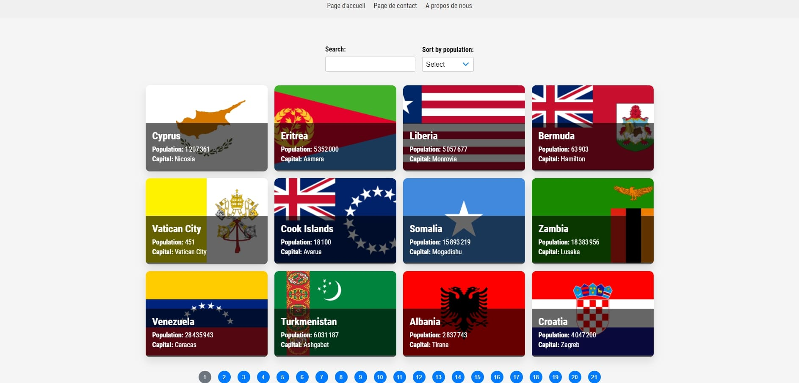

# 🌍 Country Explorer

Country Explorer is a frontend application that allows users to browse and search for countries, view their details such as population and capital, and sort them based on their population. The app fetches data from the REST Countries API and presents it in a visually appealing way.

## ✨ Features

- Display a list of countries with their flags, names, population, and capital.
- Search for countries by name.
- Sort countries by population in ascending or descending order.
- Pagination to browse through multiple pages of countries.
- Responsive design that works on various devices and screen sizes.

## 🛠️ Technologies Used

- React: A JavaScript library for building user interfaces.
- CSS: Used for styling the application and creating a modern, attractive design.
- REST Countries API: A free, reliable, and fast REST API to fetch country data.

## 🚀 Getting Started

To run the Country Explorer app locally, follow these steps:

1. Clone the repository:

git clone https://github.com/Nassim84/flag-react-app.git

2. Navigate to the project directory:

cd flag-react-app 

3. Install the dependencies:
   
npm install

4. Start the development server:

npm start

The app will be available at `http://localhost:3000` in your browser.

## 🤝 Contributing

If you'd like to contribute to the Country Explorer project, please follow these guidelines:

1. Fork the repository.
2. Create a new branch for your feature or bug fix.
3. Make the necessary changes and commit them with clear, descriptive commit messages.
4. Submit a pull request, explaining the changes you made and the problem they solve.

## 📄 License

The Country Explorer project is open-source and released under the [MIT License](LICENSE).

## 🖼️ Site Preview

**Country Explorer Site Preview:** This image provides a sneak peek of the Country Explorer frontend application. Explore countries, their flags, populations, and more with this intuitive and visually appealing web app!

